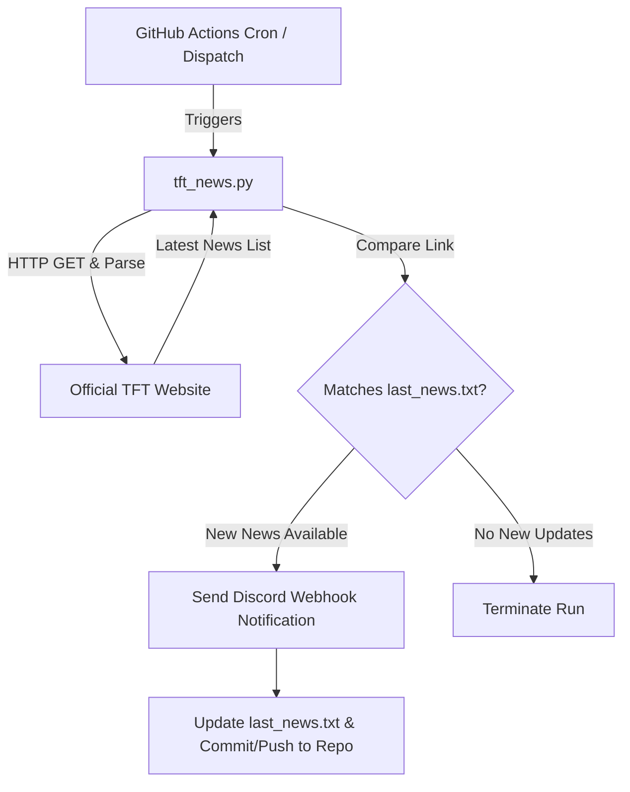
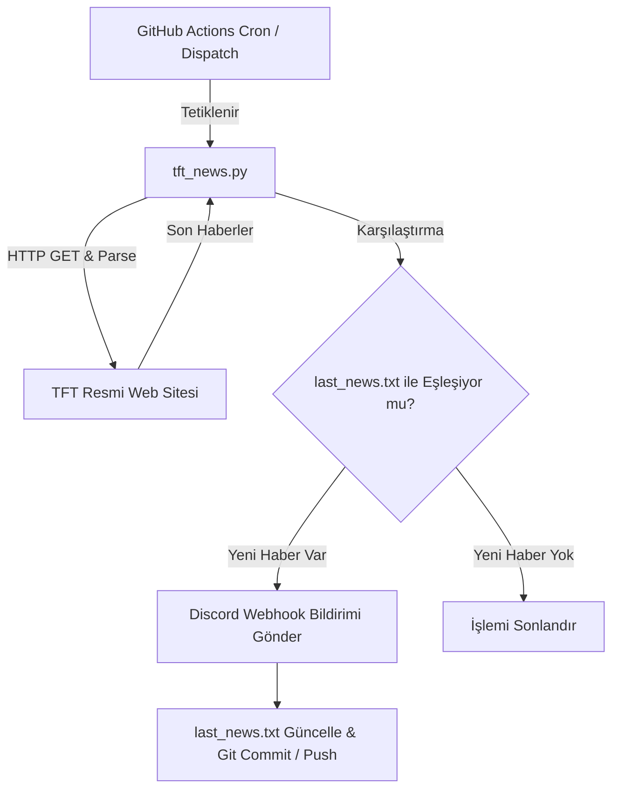

# 📢 TFT News Bot (Teamfight Tactics News & Patch Updates)

<div align="center">


**[English](#-english)** | **[Türkçe](#-türkçe)**

</div>

---

<a name="-english"></a>
## 🇬🇧 English

A serverless automation bot that automatically tracks the latest official **Teamfight Tactics (TFT)** news, patch notes, and game updates, posting instant notifications with role mentions to your Discord channel via Webhook.

### ✨ Features

- 🔍 **Automated Web Scraping:** Regularly scrapes the official TFT news portal (`https://teamfighttactics.leagueoflegends.com/tr-tr/news/`).
- ⚡ **24/7 Serverless Execution:** Runs on **GitHub Actions** hourly without requiring any VPS or dedicated server.
- 📢 **Discord Webhook Notifications:** Instantly sends article titles and direct URLs to your Discord channel with custom role pings.
- 🛡️ **Duplicate Prevention:** Tracks the last posted article in `last_news.txt` to prevent duplicate notifications.
- 🔄 **Sequential Delivery:** When multiple new articles are found, they are posted in chronological order (oldest to newest).

### 🛠️ Architecture & Workflow



### ⚙️ Setup & Configuration

#### 1. Clone or Fork the Repository
```bash
git clone https://github.com/sefepolat/TFT-News-Bot.git
cd TFT-News-Bot
```

#### 2. Configure Discord Webhook Secret
1. In your Discord server, go to `Channel Settings > Integrations > Webhooks > New Webhook`.
2. Copy the Webhook URL.
3. In your GitHub repository, go to `Settings > Secrets and variables > Actions`.
4. Click **New repository secret**:
   - **Name:** `DISCORD_WEBHOOK`
   - **Secret:** *Your copied Discord Webhook URL*

#### 3. Update Role ID and Settings
Customize the variables inside `tft_news.py` to match your server:
- **`ROLE_ID`**: The Discord Role ID to be pinged on new updates.
- **`TARGET_URL`**: Target TFT news URL (Default is Turkish, change locale code if needed, e.g., `/en-us/news/`).

```python
# tft_news.py
TARGET_URL = "https://teamfighttactics.leagueoflegends.com/tr-tr/news/"
ROLE_ID = "YOUR_DISCORD_ROLE_ID"
```

#### 4. Enable GitHub Actions Write Permissions
To allow GitHub Actions to commit `last_news.txt` back to the repository:
1. Navigate to `Settings > Actions > General`.
2. Under **Workflow permissions**, select **"Read and write permissions"** and click Save.

### 💻 Local Development

To test the bot locally on your machine:

```bash
# Install dependencies
pip install -r requirements.txt

# Run with environment variable (PowerShell)
$env:DISCORD_WEBHOOK="YOUR_DISCORD_WEBHOOK_URL"
python tft_news.py

# Run with environment variable (Linux / macOS Bash)
DISCORD_WEBHOOK="YOUR_DISCORD_WEBHOOK_URL" python tft_news.py
```

### ⏰ Scheduling (Cron Expression)

By default, `.github/workflows/check_news.yml` runs every hour at minute 17:
```yaml
on:
  schedule:
    - cron: '17 * * * *'
  workflow_dispatch: # Allows manual trigger from Actions tab
```

---

<a name="-türkçe"></a>
## 🇹🇷 Türkçe

Resmi **Teamfight Tactics (TFT)** web sitesindeki en son haberleri, güncellemeleri ve yama notlarını otomatik olarak takip eden, yeni içerik yayınlandığında Discord sunucunuza webhook aracılığıyla anında bildirim gönderen sunucusuz (serverless) bir otomasyon botudur.

### ✨ Özellikler

- 🔍 **Otomatik Web Scraping:** Resmi TFT haber sayfasını (`https://teamfighttactics.leagueoflegends.com/tr-tr/news/`) düzenli aralıklarla tarar.
- ⚡ **7/24 Sunucusuz Çalışma:** Herhangi bir VPS veya sunucuya ihtiyaç duymadan **GitHub Actions** üzerinde saatlik olarak çalışır.
- 📢 **Discord Webhook Bildirimleri:** Yeni bir haber veya yama notu düştüğünde belirlenen rolü etiketleyerek Discord kanalına anında haber başlığı ve bağlantısı gönderir.
- 🛡️ **Mükerrer Bildirim Koruması:** Gönderilen son haber linkini `last_news.txt` dosyasında depolar ve aynı haberin tekrar tekrar iletilmesini engeller.
- 🔄 **Sıralı İletim:** Birden fazla yeni haber tespit edildiğinde eski olandan yeni olana doğru kronolojik sırayla paylaşım yapar.

### 🛠️ Çalışma Mantığı



### ⚙️ Kurulum ve Yapılandırma

#### 1. Repoyu Klonlayın veya Fork'layın
```bash
git clone https://github.com/sefepolat/TFT-News-Bot.git
cd TFT-News-Bot
```

#### 2. Discord Webhook Secret'ını Ekleyin
1. Discord sunucunuzda bildirimlerin düşmesini istediğiniz kanala gidin: `Kanal Ayarları > Entegrasyonlar > Webhook'lar > Yeni Webhook`.
2. Webhook URL'sini kopyalayın.
3. GitHub reponuzda `Settings > Secrets and variables > Actions` bölümüne gidin.
4. **New repository secret** butonuna tıklayın:
   - **Name:** `DISCORD_WEBHOOK`
   - **Secret:** *Kopyaladığınız Discord Webhook URL'si*

#### 3. Rol ID ve Ayarları Güncelleyin
`tft_news.py` dosyası içerisindeki ayarları kendi sunucunuza göre özelleştirin:
- **`ROLE_ID`**: Bildirimde etiketlenmesini istediğiniz Discord rolünün ID'si.
- **`TARGET_URL`**: Takip edilecek TFT haber sayfası (Varsayılan: TR).

```python
# tft_news.py
TARGET_URL = "https://teamfighttactics.leagueoflegends.com/tr-tr/news/"
ROLE_ID = "BURAYA_ROL_ID_GIRIN"
```

#### 4. GitHub Actions Workflow İzinleri
Workflow'un `last_news.txt` dosyasını otomatik güncelleyip repoya commit edebilmesi için:
1. Reponuzda `Settings > Actions > General` sayfasına gidin.
2. **Workflow permissions** bölümünde **"Read and write permissions"** seçeneğini işaretleyin ve kaydedin.

### 💻 Yerel Geliştirme (Local Setup)

Projeyi kendi bilgisayarınızda test etmek için:

```bash
# Bağımlılıkları yükleyin
pip install -r requirements.txt

# Windows (PowerShell)
$env:DISCORD_WEBHOOK="YOUR_DISCORD_WEBHOOK_URL"
python tft_news.py

# Linux / macOS (Bash)
DISCORD_WEBHOOK="YOUR_DISCORD_WEBHOOK_URL" python tft_news.py
```

### ⏰ Zamanlama Ayarı (Cron Schedule)

Varsayılan olarak `.github/workflows/check_news.yml` dosyası her saat başının 17. dakikasında çalışır:
```yaml
on:
  schedule:
    - cron: '17 * * * *'
  workflow_dispatch: # Manuel tetiklemeye izin verir
```

---

## 📦 Bağımlılıklar / Dependencies

- [Python 3.12+](https://www.python.org/)
- [requests](https://requests.readthedocs.io/) - HTTP Requests & Discord Webhook
- [beautifulsoup4](https://www.crummy.com/software/BeautifulSoup/) - HTML Parsing & Web Scraping

---

## 📄 Lisans / License

This project is open-source and free to use under the MIT standards. / Bu proje açık kaynaklıdır ve serbestçe kullanılabilir / geliştirilebilir.
