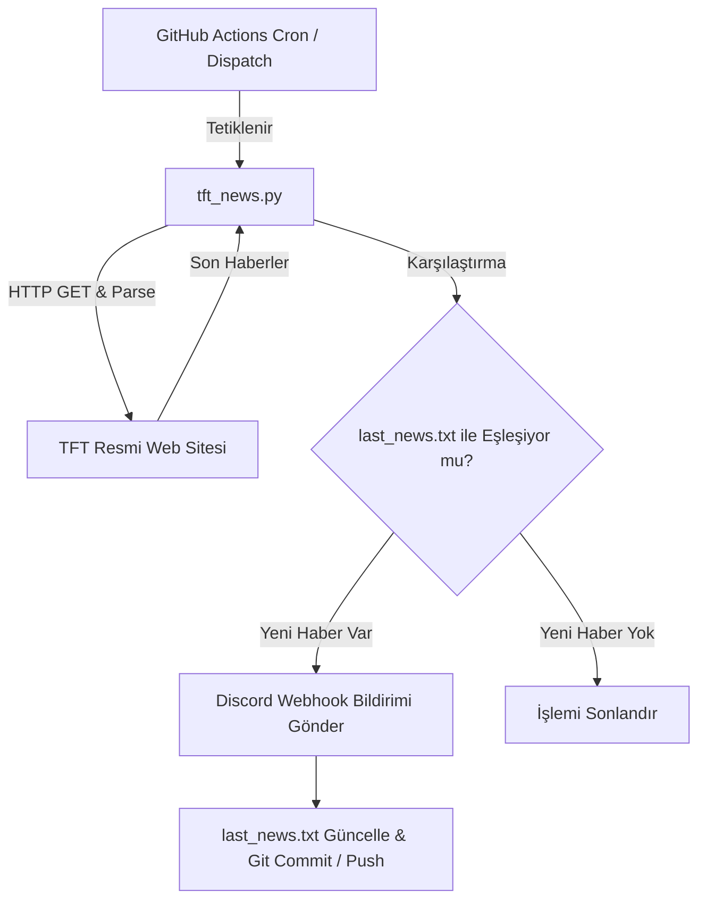

# 📢 TFT News Bot (Teamfight Tactics Haber Botu)


Resmi **Teamfight Tactics (TFT)** web sitesindeki en son haberleri, güncellemeleri ve yama notlarını otomatik olarak takip eden, yeni içerik yayınlandığında Discord sunucunuza webhook aracılığıyla anında bildirim gönderen sunucusuz (serverless) bir otomasyon botudur.

---

## 🚀 Özellikler

- 🔍 **Otomatik Web Scraping:** Resmi TFT TR haber sayfasını (`teamfighttactics.leagueoflegends.com`) düzenli aralıklarla tarar.
- ⚡ **7/24 Sunucusuz Çalışma:** Herhangi bir VPS veya sunucuya ihtiyaç duymadan **GitHub Actions** üzerinde saatlik olarak çalışır.
- 📢 **Discord Webhook Bildirimleri:** Yeni bir haber veya yama notu düştüğünde belirlenen rolü etiketleyerek Discord kanalına anında haber başlığı ve bağlantısı gönderir.
- 🛡️ **Mükerrer Bildirim Koruması:** Gönderilen son haber linkini `last_news.txt` dosyasında depolar ve aynı haberin tekrar tekrar iletilmesini engeller.
- 🔄 **Sıralı İletim:** Birden fazla yeni haber tespit edildiğinde eski olandan yeni olana doğru kronolojik sırayla paylaşım yapar.

---

## 🛠️ Çalışma Mantığı



---

## ⚙️ Kurulum ve Yapılandırma

### 1. Repoyu Klonlayın veya Fork'layın
```bash
git clone https://github.com/sefepolat/TFT-News-Bot.git
cd TFT-News-Bot
```

### 2. Discord Webhook Secret'ını Ekleyin
1. Discord sunucunuzda bildirimlerin düşmesini istediğiniz kanala gidin: `Kanal Ayarları > Entegrasyonlar > Webhook'lar > Yeni Webhook`.
2. Webhook URL'sini kopyalayın.
3. GitHub reponuzda `Settings > Secrets and variables > Actions` bölümüne gidin.
4. **New repository secret** butonuna tıklayın:
   - **Name:** `DISCORD_WEBHOOK`
   - **Secret:** *Kopyaladığınız Discord Webhook URL'si*

### 3. Rol ID ve Ayarları Güncelleyin
`tft_news.py` dosyası içerisindeki ayarları kendi sunucunuza göre özelleştirin:
- **`ROLE_ID`**: Bildirimde etiketlenmesini istediğiniz Discord rolünün ID'si.
- **`TARGET_URL`**: Takip edilecek TFT haber sayfası (Varsayılan: TR).

```python
# tft_news.py
TARGET_URL = "https://teamfighttactics.leagueoflegends.com/tr-tr/news/"
ROLE_ID = "BURAYA_ROL_ID_GIRIN"
```

### 4. GitHub Actions Workflow İzinleri
Workflow'un `last_news.txt` dosyasını otomatik güncelleyip repoya commit edebilmesi için:
1. Reponuzda `Settings > Actions > General` sayfasına gidin.
2. **Workflow permissions** bölümünde **"Read and write permissions"** seçeneğini işaretleyin ve kaydedin.

---

## 💻 Yerel Geliştirme (Local Setup)

Projeyi kendi bilgisayarınızda test etmek için:

1. Gerekli bağımlılıkları yükleyin:
```bash
pip install -r requirements.txt
```

2. Çevre değişkenini ayarlayarak çalıştırın:
```bash
# Windows (PowerShell)
$env:DISCORD_WEBHOOK="YOUR_DISCORD_WEBHOOK_URL"
python tft_news.py

# Linux / macOS (Bash)
DISCORD_WEBHOOK="YOUR_DISCORD_WEBHOOK_URL" python tft_news.py
```

---

## ⏰ Zamanlama Ayarı (Cron Schedule)

Varsayılan olarak `.github/workflows/check_news.yml` dosyası her saat başının 17. dakikasında çalışır:
```yaml
on:
  schedule:
    - cron: '17 * * * *'
  workflow_dispatch: # Manuel tetiklemeye izin verir
```
İhtiyacınıza göre cron ifadesini değiştirebilir veya GitHub Actions sekmesinden **"Run workflow"** diyerek anında manuel tetikleyebilirsiniz.

---

## 📦 Bağımlılıklar

- [Python 3.12+](https://www.python.org/)
- [requests](https://requests.readthedocs.io/) - Web istekleri ve Webhook gönderimi
- [beautifulsoup4](https://www.crummy.com/software/BeautifulSoup/) - HTML Parsing & Web Scraping

---

## 📄 Lisans

Bu proje açık kaynaklıdır ve serbestçe kullanılabilir / geliştirilebilir.